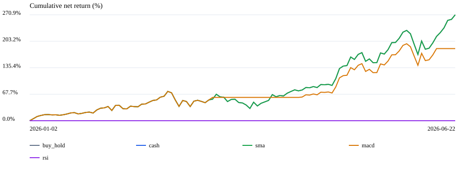
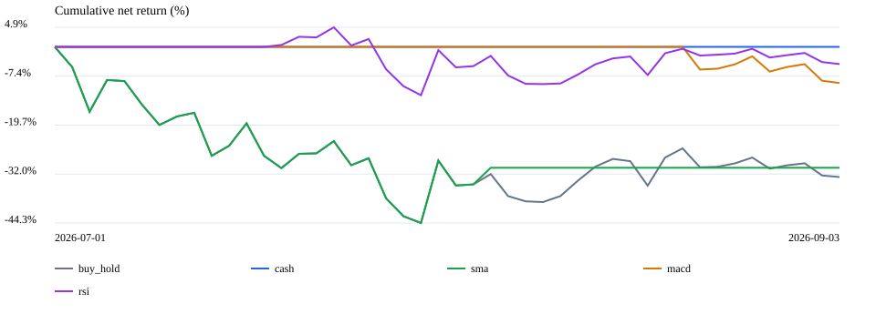

# 두 구간 기준선 평가

탐색적 가격 기반 과거 평가. AI 성과를 의미하지 않는다.

## A · 2026-01-01~2026-06-22 · 초기 보유 0% · 비용 10bp · step · 반복 1

| 전략 | 순수익률 | 매수보유 대비 | MDD | 체결 |
|---|---:|---:|---:|---:|
| 매수 후 보유 | +270.87% | +0.00pp | -24.88% | 2 |
| 현금 유지·기존 보유 청산 | +0.00% | -270.87pp | 0.00% | 0 |
| SMA 20/60 | +270.87% | +0.00pp | -24.88% | 2 |
| MACD | +184.49% | -86.38pp | -22.11% | 8 |
| RSI 14 | +0.00% | -270.87pp | 0.00% | 0 |

## A · 2026-01-01~2026-06-22 · 초기 보유 50% · 비용 10bp · step · 반복 1

| 전략 | 순수익률 | 매수보유 대비 | MDD | 체결 |
|---|---:|---:|---:|---:|
| 매수 후 보유 | +271.24% | +0.00pp | -24.88% | 2 |
| 현금 유지·기존 보유 청산 | +0.01% | -271.23pp | 0.00% | 2 |
| SMA 20/60 | +271.24% | +0.00pp | -24.88% | 2 |
| MACD | +184.79% | -86.45pp | -22.11% | 8 |
| RSI 14 | +10.24% | -261.00pp | -0.87% | 2 |

## B · 2026-07-01~2026-09-03 · 초기 보유 0% · 비용 10bp · step · 반복 1

| 전략 | 순수익률 | 매수보유 대비 | MDD | 체결 |
|---|---:|---:|---:|---:|
| 매수 후 보유 | -32.75% | +0.00pp | -44.31% | 2 |
| 현금 유지·기존 보유 청산 | +0.00% | +32.75pp | 0.00% | 0 |
| SMA 20/60 | -30.41% | +2.35pp | -44.31% | 4 |
| MACD | -9.09% | +23.66pp | -9.09% | 2 |
| RSI 14 | -4.32% | +28.44pp | -16.29% | 1 |

## B · 2026-07-01~2026-09-03 · 초기 보유 50% · 비용 10bp · step · 반복 1

| 전략 | 순수익률 | 매수보유 대비 | MDD | 체결 |
|---|---:|---:|---:|---:|
| 매수 후 보유 | -32.61% | +0.00pp | -44.19% | 2 |
| 현금 유지·기존 보유 청산 | +0.13% | +32.74pp | 0.00% | 2 |
| SMA 20/60 | -30.26% | +2.35pp | -44.19% | 4 |
| MACD | -8.98% | +23.63pp | -9.09% | 4 |
| RSI 14 | -18.39% | +14.22pp | -28.11% | 1 |


## 평가 조건과 해석

전체 12조건의 수치·비용·회전율·노출·입력 checksum: [기계 판독 결과 JSON](benchmark_results/regimes.json).
아래 표는 기본 비용 10bp이며, 나머지 비용 조건도 JSON에서 빠짐없이 공개한다.

- 삼성전자·SK하이닉스 독립 가상 계좌 합산, 각 100만원. 12거래일마다 판단, 다음 거래일 시가 체결.
- 초기 보유 50%는 전날 종가 기준 자산 부여다. 현금 전략도 첫날 기존 주식을 청산하므로 시가 갭과 비용으로 0%와 다를 수 있다.
- 10/30/50bp × 초기 보유 0/50% × 구간 2개 = 12조건 완료. 비용은 실제 세율이 아닌 편도 총비용 가정.
- 누적 수익률은 기간 길이가 달라 직접 우열 비교하지 않는다. A 114거래일, B 45거래일.
- 수익률 크기는 실제 KIS 수정주가 입력과 해당 두 반도체 종목에 한정된다. 배당·정밀 체결·시장 대표성 미반영.
- 규칙 전략도 동일한 12일 판단 주기로 고정했다. 각 전략의 최적 성과라는 주장이 아니다.
- AI/Kronos의 새 두 구간 결과는 아직 없으며, 아래 기준선을 AI 성과로 소개하면 안 된다.
- 구간은 사용자 지정 사후 분할이다. 전체 결과를 공개하고 유리한 조건만 선택하지 않는다.
- 원시 가격은 로컬 artifacts에만 보관. 배포 전 데이터 재배포 권한을 별도로 확인해야 한다.

## 그림 (현금 시작·10bp)





## 재현

```bash
# 계획만 출력 (API/LLM 호출 없음)
.venv/bin/python scripts/benchmark_regimes.py --end 2026-09-03
# 실제 KIS 수집 후 12개 기준선 조건 실행 (LLM/GPU/주문 없음)
.venv/bin/python scripts/benchmark_regimes.py --end 2026-09-03 --run
```

보고서의 suite.json은 조건/하위 실행 위치/전체 성과를 기록하고, 하위 manifest는 캔들·소스 SHA256을 기록한다.
네트워크/API 오류가 발생하면 failed로 남기며 일부 완료 조건을 최종 순위표로 내보내지 않는다.
AI 비교는 `--strategies agents agents_kronos --policies step binary --repeats 3`로 먼저 계획을 확인한다.
실행에는 총 토론 상한 `--max-total-agent-calls`를 명시해야 하며 기본값 0은 대량 LLM 실행을 막는다.
토론 횟수 상한은 토큰/요금 상한이 아니다. 정기보고서 분할 분석의 비용 계측 후 본 평가 범위를 고정한다.

## AI 실행 상태 (2026-09-04)

GDELT 429 뒤 실제 8/19 글로벌 근거를 별도 snapshot으로 고정하고, 삼성전자 8/19 판단을
8/20~8/21에 적용하는 Agent/Agent+Kronos 1회씩의 배관 smoke test를 완료했다.
두 전략 모두 미보유 계좌에서 `Hold → WAIT`였고 수익률은 0%였다. 같은 이틀간 Buy & Hold는
+9.42%였지만, 표본이 2거래일·판단 1회뿐이므로 성능 비교가 아니라 실행 검증이다.

Provider가 보고한 토큰은 Agent 682,937개(입력 596,717·출력 86,220),
Agent+Kronos 700,640개(입력 608,504·출력 92,136)였다. 두 번째 실행 입력 중
392,848개는 cache read로 보고됐다. cache read가 무료라는 뜻은 아니며 실제 청구액도 아니다.
긴 DART 원문 분할·합성과 반복 토론이 과도한 비용의 주원인이라, 이 상태로 본 평가를 돌리지 않는다.
후속 실행부터 응답별 기본 출력 상한 4,096 토큰을 적용했지만 입력 비용 문제는 별도 개선이 필요하다.
또한 근거가 종목·판단일당 300,000자를 넘으면 LLM 호출 전에 중단한다. 상한을 높이는 것은
비용 검토 뒤 `--max-evidence-chars`로 명시해야 하며, 문자 수는 정확한 토큰/요금 상한이 아니다.
기계 판독 smoke 결과: [agent_smoke.json](benchmark_results/agent_smoke.json).

2026-09-05 후속 수정: 원문을 보존하면서 구조화 전체 재무제표와 출처 줄 번호가 있는
공시 발췌를 기본 입력으로 전환했다. 삼성전자 실제 DART 수집과 변환은 검증했으며,
수정 후 LLM 토큰·판단·성과는 아직 재측정하지 않았다. 위 smoke 숫자는 수정 전 결과다.

RunPod health와 실제 Kronos 예측 호출은 모두 성공했다. 다만 이것은 모델 예측 정확도나
Agent+Kronos 우월성을 입증하지 않는다. 전체 A/B 구간 AI 결과는 여전히 미실행이다.
