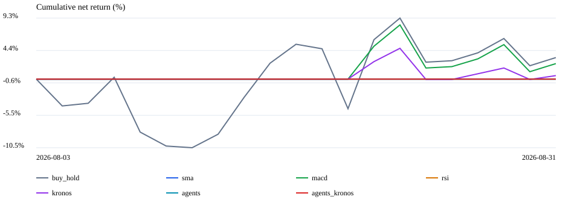
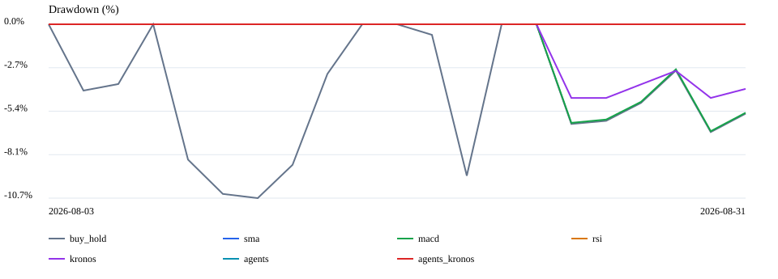

# 초기 벤치마크 결과 — 2026-09-04

**탐색적 파일럿 결과이며 우월성·미래 수익을 입증하지 않는다.**
평가 종목은 사용자 지정 삼성전자(005930), SK하이닉스(000660) 두 종목이다.
초기 LS ELECTRIC 포함 예비 실행은 아래 결과에 포함하지 않았다.
방법: [BENCHMARK_PROTOCOL.md](BENCHMARK_PROTOCOL.md).

## 전체 비교군 파일럿

- 기간: 2026-08-03~2026-08-31, 실제 20거래일
- 판단일: 2026-07-31, 2026-08-19 (종가 자료까지 활용하는 마감 후 분석)
- 종목별 가상 초기자금 100만원, 총 200만원, 최초 현금 100%
- 12거래일 판단, 다음 거래일 시가 체결, 편도 가정비용 10bp
- 실제 KIS/DART/FRED/ECOS 데이터와 RunPod Kronos-base, 설정된 LLM을 호출
- Agent 두 버전 × 2종목 × 2판단일 = 전체 토론 8회
- Buy/Overweight=전액 매수, Hold=기존 노출 유지, Underweight/Sell=현금화
- LLM 단일 실행, Kronos 날짜별 10경로를 중앙값 집계. 반복 실험은 미실시

| 전략 | 비용 차감 수익률 | Sharpe (rf=0) | 최대낙폭 | 체결 수 |
|---|---:|---:|---:|---:|
| 매수 후 보유 | +3.29% | 0.895 | -10.74% | 2 |
| SMA 20/60 | 0.00% | N/A | 0.00% | 0 |
| MACD | +2.37% | 1.006 | -6.60% | 2 |
| RSI 14 | 0.00% | N/A | 0.00% | 0 |
| Kronos 단독 | +0.53% | 0.410 | -4.55% | 1 |
| 한국형 Agents | 0.00% | N/A | 0.00% | 0 |
| 한국형 Agents + Kronos | 0.00% | N/A | 0.00% | 0 |

| 전략 | 삼성전자 | SK하이닉스 |
|---|---:|---:|
| 매수 후 보유 | +4.73% | +1.85% |
| MACD | +1.07% | +3.68% |
| Kronos 단독 | +1.07% | 0.00% |
| 한국형 Agents | 0.00% | 0.00% |
| 한국형 Agents + Kronos | 0.00% | 0.00% |

### 관측한 문제

Agent의 8개 판단은 모두 Hold/No entry였다. 이 구간에서 Kronos를 추가해도 실행 신호는 변하지 않았다.
무거래의 Sharpe는 N/A이며, 무거래로 낙폭이 0이라고 해서 수익 예측이 뛰어나다고 해석하지 않는다.
각 비교군의 매수보유 대비 평균 일별 초과 로그수익 block-bootstrap 95% 구간은 0을 포함했다.
판단 시점이 너무 적고 모델 반복도 없어 전략 차이의 유의성을 주장할 수 없다.

삼성전자 8/19 최종 판단은 기술·수급 충돌, 실적/밸류에이션 자료 부족, 높은 변동성 및
전액 진입 조건을 관망 이유로 들었다. Kronos 포함 판단은 작은 중앙 예상수익과 큰 하방 분포도 언급했다.
따라서 전액 매수/현금 이분법 정책이 원래 5등급의 점진적 배분 의미를 얼마나 바꾸는지 별도 검증이 필요하다.
이 결과를 보고 성적을 높이도록 같은 구간의 프롬프트를 수정하지 않았다.

현재 결과는 가격 기준 수익률이며 배당, 정밀 체결 가능성, 과거 공시·경제지표의 완전한 공개시점,
모델 사전학습 정보 누수까지 통제한 검증은 아니다. 최초 파일럿은 개발 중 실행되어 실행 시점 소스 스냅샷이 없다.
원본 출력/입력 checksum은 로컬 artifacts에 있으며 후속 실행부터 소스 SHA256과 코드 사본을 자동 저장한다.

## 1년 기준선 및 민감도 — Agent 성과가 아님

2025-09-01~2026-08-31, 243거래일, 같은 두 종목의 독립 계좌 NAV 합산.
아래 1년 실험은 기준선만 완료했다. **1년 Agent/Kronos 전체 비교와 반복 평가는 미실시**다.

| 전략 | 12일 판단·10bp | 12일 판단·30bp | 12일 판단·50bp | 매일 판단·10bp |
|---|---:|---:|---:|---:|
| 매수 후 보유 | +412.09% | +411.07% | +410.05% | +412.09% |
| SMA 20/60 | +307.41% | +305.78% | +304.16% | +325.55% |
| MACD | +247.99% | +241.78% | +235.69% | +254.43% |
| RSI 14 | 0.00% | 0.00% | 0.00% | -6.04% |

수익률의 크기는 이 두 종목과 해당 가격 구간에 한정된다. 원본 KIS 첫 시가/마지막 종가를 확인했다:
삼성전자 68,400→260,000원, SK하이닉스 259,500→1,674,000원. 현재 가격이나 향후 수익 전망이 아니다.
12일·10bp 조건에서 매수보유 MDD는 -50.73%, MACD MDD는 -18.63%로 위험과 수익의 차이도 크다.
종목 2개가 모두 반도체이므로 한국 시장 전체에 일반화할 수 없다.

## 다음 검증 단계

1. 실행 등급과 점진적 배분 정책을 검증용 구간에서 정한 뒤 고정한다.
2. 공개시점·KRX 휴장일·원시 입력 검증을 강화한다.
3. 동일 조건 1년 전체 비교를 최소 3회 반복하고 비용 민감도를 확인한다.
4. 과거 데이터 누수 한계를 보완할 전향적 paper-trading 기록을 쌓는다.

이번 토론 8회는 두 종목 병렬 실행으로 약 21분이 걸렸다. 같은 설정의 1년 전체 비교는
약 84회 토론이 필요하며, 대략 직렬 6~7시간 또는 종목별 병렬 3~4시간이 예상된다.
이는 실행시간 추정이며 LLM 요금 추정은 아니다. 긴 본 평가 전 API 예산과 사용량 계측을 확정해야 한다.
